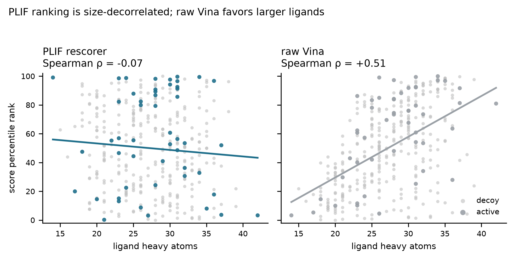
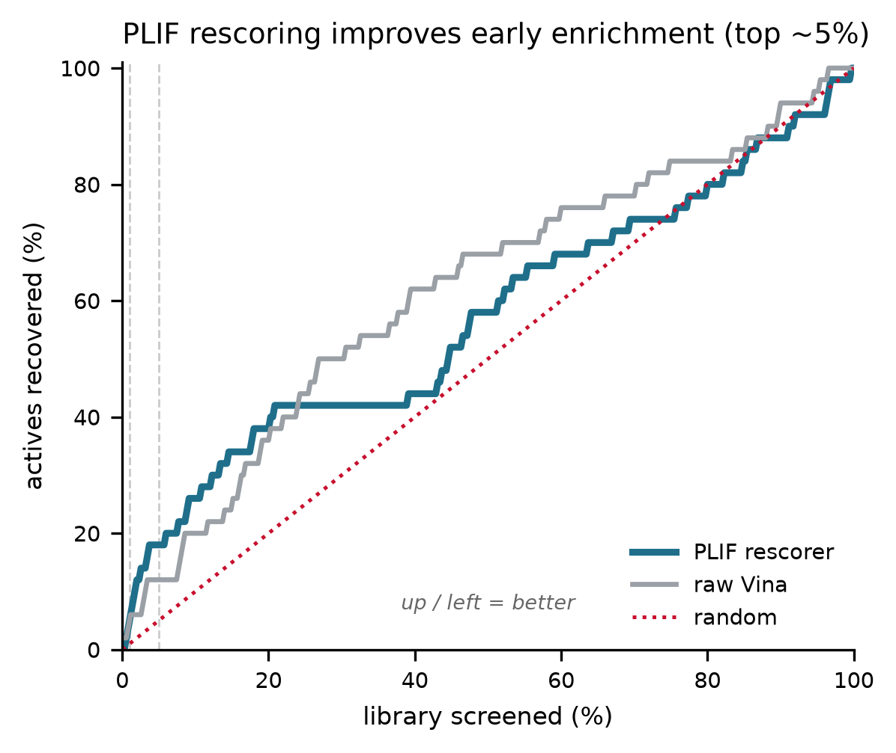

# vina-rescore — interaction-fingerprint rescoring of AutoDock Vina poses

Rescore AutoDock Vina docking poses with **protein–ligand interaction
fingerprints (PLIFs)** and an interpretable classifier, and benchmark the result
against raw Vina affinity for **early enrichment** — the quantity a virtual
screen actually optimizes. Demonstrated on the DUD-E CDK2 target.

> **Attribution.** The scientific idea and design of this project are my own.
> I used [Claude Science](https://www.anthropic.com) as a coding and
> organisation assistant — to help implement, test, and document the pipeline.
> All results were generated by the code in this repository and can be
> reproduced with the commands below.

## What it does

A modular pipeline that:

1. **Feature extraction** — `prolif` + `MDAnalysis` build a binary PLIF for each
   docked pose over pocket residues within 6.0 Å (H-bond donors/acceptors,
   hydrophobic, π-stacking, cation-π).
2. **Scaffold-aware splitting** — generic Bemis–Murcko scaffolds (RDKit) group
   molecules so the model is always evaluated on chemical series it has never
   seen (no scaffold spans train and test).
3. **Model** — LightGBM (or an L1-logistic comparator) on the interaction
   bitvectors, with min-frequency and zero-variance bit filters and balanced
   class weights.
4. **Benchmarking** — ROC-AUC, BEDROC (α=20), and EF1% / EF5%, with
   class-stratified bootstrap confidence intervals, all computed for the
   rescorer and raw Vina on the identical ligand set.
5. **Interpretability** — top predictive residue–interaction bits with per-bit
   active/decoy enrichment, validated against known CDK2 ATP-site determinants.

## Headline results (DUD-E CDK2, scaffold-CV, 50 actives / 300 decoys)

Reported honestly — see [`outputs/RESULTS.md`](outputs/RESULTS.md) and
[`outputs/REVIEW.md`](outputs/REVIEW.md) for the full analysis and a referee-style
critique.

- **Robust, defensible findings:** the PLIF rescore is **size-decorrelated**
  (Spearman ρ = −0.07 vs heavy-atom count) whereas raw Vina is **size-biased**
  (ρ = +0.51); and the top *discriminative* bit is the canonical **hinge Leu83
  H-bond acceptor** (3.2× enrichment in actives).
- **Non-significant trend:** PLIF shows better early enrichment (BEDROC +0.13,
  EF5% +1.25) but **no head-to-head metric reaches 95% significance** at 50
  actives; raw Vina holds a small edge on global ROC-AUC. The two scorers'
  top-5% lists overlap in only 1 of 18 compounds — they are complementary, which
  motivates a consensus-scoring follow-up on a larger active set.





## Repository layout

```
vina_rescore/        # the package
  config.py          # dataclass config (paths, box, CV, model knobs)
  data.py            # DUD-E download, manifest, docking box
  prep.py            # receptor + ligand preparation (Meeko)
  docking.py         # AutoDock Vina wrapper (resumable)
  plif.py            # prolif/MDAnalysis interaction fingerprints
  splits.py          # Bemis-Murcko scaffold splitting
  models.py          # LightGBM / L1-logistic + bit filtering
  metrics.py         # ROC-AUC, BEDROC, EF, bootstrap CIs
  interpret.py       # top features + per-bit class enrichment
  pipeline.py        # scaffold-CV benchmark orchestration
  plots.py           # publication-style figures
run_dock.py          # dock the manifest
run_dock_resume.py   # resume an interrupted docking run
run_analysis.py      # build RESULTS.md + all figures
outputs/             # results, tables, report (committed)
data/                # receptor, manifest, docked poses (large maps/raw gitignored)
```

## Installation

Requires Python 3.11+. Dependencies are pinned in `requirements.txt`.

```bash
git clone https://github.com/mukherjeesutanu/vina-rescore.git
cd vina-rescore
conda create -n vina-rescore python=3.13 -y   # or a venv
conda activate vina-rescore
pip install -r requirements.txt
```

AutoDock Vina and Meeko are installed via pip (`vina`, `meeko`); RDKit,
`prolif`, and `MDAnalysis` also install from PyPI wheels.

## Usage

The committed `data/docked_poses.sdf` lets you reproduce the analysis without
re-docking:

```bash
python run_analysis.py          # -> outputs/RESULTS.md + figures/
```

To regenerate the docking from scratch (downloads DUD-E CDK2; several hours on a
laptop):

```bash
python run_dock.py              # writes data/docked_poses.sdf
python run_dock_resume.py       # resume if interrupted
python run_analysis.py
```

All knobs (docking box, exhaustiveness, dataset size, CV folds, model type) live
in `vina_rescore/config.py` and are captured per run in `outputs/run_config.json`.

## Data provenance

Actives and decoys are from **DUD-E** (Directory of Useful Decoys, Enhanced),
target CDK2 — Mysinger, Carchia, Irwin & Shoichet, *J. Med. Chem.* 2012,
55(14):6582–6594 (https://dude.docking.org). DUD-E's property-matched decoys
carry known biases; see the Limitations section of `outputs/RESULTS.md`.

## Limitations

Single target, single pose per ligand, 50 actives (subsampled). The
early-enrichment advantage is a trend, not a significant result, at this sample
size. See `outputs/RESULTS.md` for the full list.

## License

MIT — see [`LICENSE`](LICENSE).

## How to cite

If this code is useful, please cite the repository (see `CITATION.cff`) and the
DUD-E dataset above.
