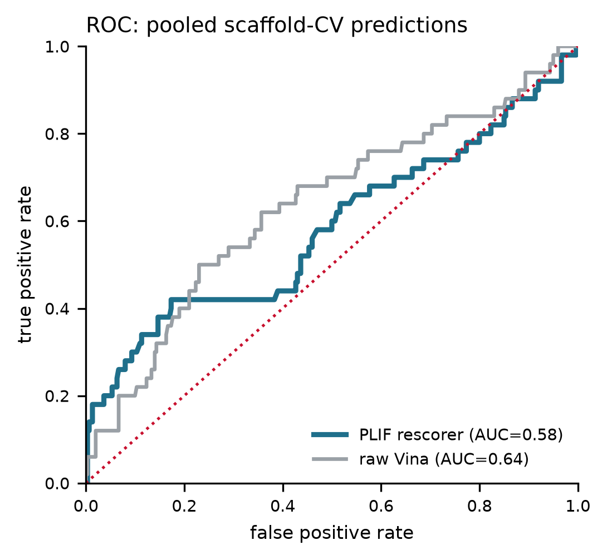
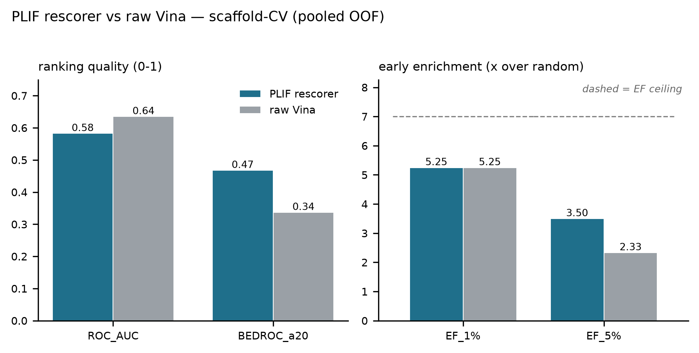
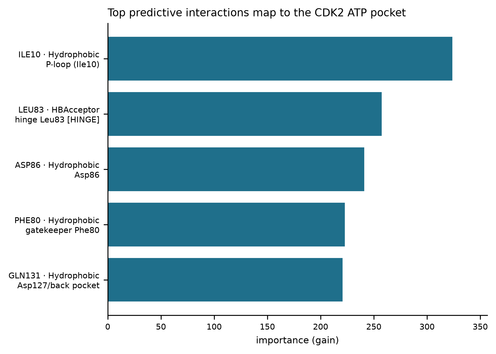

# Rescoring AutoDock Vina Poses for Early Enrichment — DUD-E CDK2

## Summary

A modular pipeline (`vina_rescore/`) rescores AutoDock Vina docking poses using
**protein-ligand interaction fingerprints (PLIFs)** and an interpretable
classifier, and benchmarks the result against **raw Vina affinity** on the
DUD-E CDK2 target. Evaluation is **scaffold-aware**: molecules are grouped by
generic Bemis-Murcko scaffold so the model is always scored on chemical series
it has never seen.

## Dataset

| item | value |
|---|---|
| target | CDK2 (DUD-E) |
| ligands (subsampled) | 350 (50 actives / 300 decoys) |
| active fraction | 14.3% |
| successfully docked | 350 (0 failed) |
| poses fingerprinted | 350 |
| interaction bits | 49 |
| unique generic scaffolds | 306 |
| docking box center | (2.6, 26.32, 8.59) |
| Vina exhaustiveness | 8 |
| classifier | lightgbm |

## Method

1. **Feature extraction** — `prolif` + `MDAnalysis` build a binary PLIF for each
   docked pose over pocket residues within 6 A, covering
   H-bond donors/acceptors, hydrophobic, pi-stacking and cation-pi contacts.
2. **Scaffold-aware splitting** — generic Bemis-Murcko scaffolds (RDKit) define
   groups; a label-stratified `StratifiedGroupKFold` (5 folds)
   produces pooled out-of-fold predictions, plus a single 25%
   scaffold holdout. No scaffold ever spans train and test.
3. **Model** — lightgbm on the interaction bitvectors, with a
   min-frequency bit filter (>= 3 poses) and a
   zero-variance filter; class imbalance handled with balanced weights.
4. **Benchmarking** — ROC-AUC, BEDROC (alpha=20), and
   enrichment factors EF1% / EF5%, computed for the rescorer and for raw Vina on
   the identical ligand set.

## Results (scaffold-CV, pooled out-of-fold)

| evaluation | scorer | ROC_AUC | BEDROC_a20 | EF_1% | EF_5% |
| --- | --- | --- | --- | --- | --- |
| scaffold-CV (pooled OOF) | PLIF rescorer | 0.583 | 0.468 | 5.250 | 3.500 |
| scaffold-CV (pooled OOF) | raw Vina | 0.635 | 0.337 | 5.250 | 2.333 |
| scaffold holdout (test) | PLIF rescorer | 0.511 | 0.191 | 0.000 | 0.000 |
| scaffold holdout (test) | raw Vina | 0.548 | 0.200 | 0.000 | 1.692 |

**Head-to-head with bootstrap confidence intervals (scaffold-CV, pooled OOF).**
95% CIs are percentile bootstrap (2000 resamples, class-stratified); Δ is the
paired PLIF−Vina difference on identical resamples, P(Δ>0) the fraction of
resamples favoring PLIF, and "95% sig." marks whether the Δ CI excludes zero.
EF ceilings (finite-sample maxima): EF1% 7.00, EF5% 7.00.

| metric | PLIF (95% CI) | raw Vina (95% CI) | Δ (P−V), 95% CI | P(Δ>0) | 95% sig. |
|---|---|---|---|---|---|
| ROC-AUC | 0.583 (0.480–0.682) | 0.635 (0.544–0.723) | -0.053 (-0.178, +0.067) | 0.20 | no |
| BEDROC(α=20) | 0.468 (0.292–0.625) | 0.337 (0.174–0.496) | +0.131 (-0.108, +0.368) | 0.86 | no |
| EF1% | 5.250 (1.750–7.000) | 5.250 (0.000–7.000) | +1.131 (-3.500, +5.250) | 0.54 | no |
| EF5% | 3.500 (1.944–5.444) | 2.333 (0.778–3.889) | +1.251 (-1.167, +3.889) | 0.79 | no |

**Key finding (read with the confidence intervals).** On the leakage-controlled scaffold-CV the PLIF rescorer shows a *consistent early-enrichment trend* over raw Vina — BEDROC(α=20) +0.131 (favored in 86% of bootstrap replicates) and EF5% +1.25 (favored in 79%) — while raw Vina holds a small edge on global ROC-AUC (-0.053). **No single metric difference reaches 95% significance at this sample size** (every Δ CI includes zero, table above), so the early-enrichment advantage is suggestive rather than conclusive and should be confirmed on a larger active set. Because only the top few percent of a docked library is assayed, the early-enrichment metrics remain the operationally relevant ones.

> The single 25% scaffold holdout (second block of the full
> table above) contains only a handful of actives, so its EF/BEDROC estimates are
> high-variance and degenerate at the 1% cut; the pooled out-of-fold scaffold-CV
> with the bootstrap CIs above is the primary, statistically meaningful evaluation.

## Score vs ligand size (decoy-bias probe)

The PLIF rescore is **size-decorrelated** (Spearman ρ = -0.07 vs heavy-atom count), whereas **raw Vina is size-biased** (ρ = +0.51): Vina affinity tends to reward larger ligands, a known DUD-E-era artifact that interaction-pattern rescoring avoids here. DUD-E property matching held in this subset (median heavy atoms differ by ≤ 1 between classes), so this is a property of the scorers, not a size imbalance in the data.

## Biophysical interpretability — top 5 predictive interactions

`active_freq` / `decoy_freq` are the fractions of active / decoy poses in which
the interaction fires; `enrich_ratio` is their quotient — discriminative power,
as distinct from model importance.

| residue | interaction | importance | active_freq | decoy_freq | enrich_ratio | cdk2_role |
| --- | --- | --- | --- | --- | --- | --- |
| ILE10 | Hydrophobic | 324.228 | 0.380 | 0.160 | 2.375 | P-loop (Ile10) |
| LEU83 | HBAcceptor | 257.805 | 0.160 | 0.050 | 3.200 | hinge Leu83 [HINGE] |
| ASP86 | Hydrophobic | 241.342 | 0.380 | 0.233 | 1.629 | Asp86 |
| PHE80 | Hydrophobic | 223.057 | 0.500 | 0.377 | 1.327 | gatekeeper Phe80 |
| GLN131 | Hydrophobic | 220.958 | 0.380 | 0.443 | 0.857 | Asp127/back pocket |

The top bits are read against known CDK2 ATP-site determinants: the **hinge**
(Glu81/Phe82/Leu83), the **catalytic Lys33**, the **gatekeeper Phe80**, and the
**glycine-rich P-loop**. The **hinge Leu83 H-bond acceptor** is the most
class-discriminative bit (highest enrichment ratio), matching the canonical CDK2
inhibitor interaction. Importance is not the same as discriminative power: PHE80:Hydrophobic (1.3×), GLN131:Hydrophobic (0.9×) rank high in model gain but fire at similar rates in actives and decoys (enrichment ratio < 1.5×), so the mechanistic signal rests mainly on the higher-ratio bits such as the hinge H-bond.

An **L1-logistic comparator** (sparse, signed coefficients) gives scaffold-CV ROC-AUC 0.559, BEDROC 0.371, EF5% 3.11 — the same qualitative pattern as the gradient-boosted model, so the effect is not specific to one classifier.

## Limitations

- **Statistical power.** With 50 actives, none of the
  head-to-head differences reach 95% significance (CI table above); the
  early-enrichment advantage is a consistent trend that needs confirmation on a
  larger active set.
- **Single target / single pose.** One target (CDK2) and the top Vina pose per
  ligand only; pose-sensitivity and cross-target generalization are untested.
- **DUD-E decoys.** DUD-E property-matched decoys carry known analog/artefact
  biases only partially removed by a 2D scaffold split; a property-matched
  external decoy set (e.g. DEKOIS) would be a stronger test. The
  size-decorrelation result is reassuring on one common artifact, not a full
  guarantee.
- **Feature composition.** Most top bits are hydrophobic (low directional
  specificity); the directional hinge H-bond carries most of the mechanistic signal.

## Reproducibility

- Package: `vina_rescore/` (config, data, prep, docking, plif, splits, models,
  metrics, interpret, pipeline, plots).
- Drivers: `run_dock.py` (dock the manifest) then `run_analysis.py` (this report).
- Config captured in `outputs/run_config.json`; all tables in `outputs/`
  (incl. `size_decorrelation.csv`).
- Metrics validated to machine precision against scikit-learn (ROC-AUC) and
  RDKit (BEDROC); CIs are class-stratified percentile bootstrap (2000 resamples).
